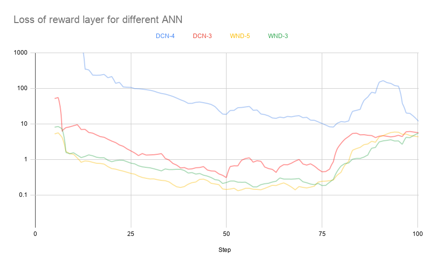

- [Deep learning models for contextual multi-armed bandit setting](#deep-learning-models-for-contextual-multi-armed-bandit-setting)
- [1. Introduction](#1-introduction)
- [2. Environment](#2-environment)
- [3. Policies](#3-policies)
  - [3.1. Epsilon-Greedy](#31-epsilon-greedy)
  - [3.2. LinUCB](#32-linucb)
  - [3.3. Neural policy](#33-neural-policy)
- [4. Agents](#4-agents)
  - [4.1. LinUCB](#41-linucb)
  - [4.2. Neural agents: Wide and deep neural networks](#42-neural-agents-wide-and-deep-neural-networks)
  - [4.3. Neural agents: Deep and Cross neural network](#43-neural-agents-deep-and-cross-neural-network)
- [5. Metrics](#5-metrics)
  - [5.1. Cumulative reward](#51-cumulative-reward)
  - [5.2. Regret](#52-regret)
- [6. Results](#6-results)
  - [6.1. Testbed](#61-testbed)
  - [6.2. Models used](#62-models-used)
  - [6.3. Analysis of ANN loss](#63-analysis-of-ann-loss)
  - [6.4. Analysis of cumulative reward](#64-analysis-of-cumulative-reward)
  - [6.5. Model size analysis](#65-model-size-analysis)
- [Conclusion](#conclusion)
- [7. References](#7-references)

# Deep learning models for contextual multi-armed bandit setting

# 1. Introduction

In the multi-armed bandit problem, an agent tries to perform actions that maximize a reward according to previous knowledge about the environment. The agent will also try to gain new knowledge about the environment utilizing exploration methods to increase its certainty about its greedy estimation of action rewards when using existing knowledge (exploitation). How the agent chooses to select actions and whether to do exploration or exploitation is called the agent's policy.

In this project, we consider a contextual setting for the multi-armed bandit problem to recommend campaigns to users. For each time step, we use a function 𝜋: X→A  that maps input features to actions. In this project, there are d actions that select one of the d campaigns to show to the users, and context features are user's features that include user, campaign proximity scores.

Learning feature crossing efficiently is crucial for the success of ML models. Deep neural networks are found to be inefficient to even approximately model 2nd or 3rd-order feature crosses [1]. The solutions proposed increased the capacity of models even further through wider and deeper networks. With bigger models, it’s more challenging to serve them with a high volume of requests. In this project, I want to evaluate new deep architectures that use efficient modeling to learn effective features with limited parameters.

# 2. Environment

We use the [open bandit dataset](https://github.com/st-tech/zr-obp) to conduct the experiments. OBD is a logged dataset fashion recommendation platform. There are d campaigns that are to be presented to the user based on the user features and user-campaign similarity scores. The dataset provides logged predictions and rewards for using two policies, either the Uniform Random policy or the Bernoulli Thompson Sampling policy for the data collection. For our experiments, we only use the random behavior policy data for the simplicity of the implementation and not having to do off-policy training techniques. Please see [obd/README.md](https://github.com/st-tech/zr-obp/blob/master/obd/README.md) for the dataset description.

At each time step, we load a batch of data points (10) and transform the categorical features into one-hot encoding, the time stamp feature into the hour of the day, and the day of the week features. The transformed features are then used as the observed context and forwarded to the agent. A reward for an action is equal to 1 if the agent has recommended the right campaign as labeled by the dataset and that there was a click on said campaign.

# 3. Policies

## 3.1. Epsilon-Greedy

A policy that does exploitation with probability 1-ε by selecting an action a that maximizes the reward p(r | x, a) per campaign a ∈ A  given an input feature vector x ∈ X. With a probability of ε the policy selects an action at random to do exploration.

## 3.2. LinUCB

An upper confidence bound policy that trains a linear model to predict p(r | x, a) the reward probability and calculates the upper confidence by adding the standard deviation to the prediction. By selecting the arm with the high upper confidence bound, the policy would explore the arms that its most unconfident about their predictions until their confidence bounds decrease.

## 3.3. Neural policy

A policy that combines both Epsilon-Greedy and LinUCB policies to use a neural network as input features encoder. The neural network, in this case, encodes the input context X->X', where X' is a learned non-linear representation of the original context. At the start, the Epsilon-Greedy policy for n-train steps to train the encoding neural network. During these steps, a layer will be added on top of the encoding network to estimate the reward. After n-train steps, the encoding network weights will be frozen, and a LinUCB policy will be used to estimate the reward given X' the output of the encoding network.

# 4. Agents

## 4.1. LinUCB

The model estimates the rewards by:

![\mathbb{E}[r_{t,a} | x_{t,a}] = x_{t,a}^\top \theta_a^*](./imgs/eq/linucb_reward.svg)

and the action is selected to maximize the upper confidence bound as follows

 

where A_a^-1 is the square of the design matrix and is interpreted as the covariance of the click prediction estimation. Then α is the exploration parameter and the whole term after it is the standard deviation of the estimate [2].

This policy chooses optimism in case of uncertainty, and the algorithm keeps on collecting data about arms that have high variance in predictions.

## 4.2. Neural agents: Wide and deep neural networks

The first neural agent we introduce is based on the wide and deep neural net architecture. The input is used as input into two parts of the ANN, the first is a shallow linear combination layer, and the second is a deep ANN. We experimented with two depths of deep towers:
Five layers with the following dimensions: 4096, 2048, 1024, 128, 128
Three layers with the following dimensions: 4096, 128, 128

The neural networks were trained for 100 training steps with an Epsilon-Greedy policy.

## 4.3. Neural agents: Deep and Cross neural network

A cross-network efficiently applies explicit feature crossing. It is composed of cross layers, with each layer having the following formula [1]: 

Besides the cross layers stack, we have two layers for fully connected layers of dimensions (128, 128) and one linear combination layer.

# 5. Metrics

## 5.1. Cumulative reward

The sum of rewards the agent achieved at each time step.

## 5.2. Regret

The difference between the highest reward at time step t and the reward that the policy achieved.
![Regret^\pi = \mathbb{E}[R_n^\pi] = \mathbb{E}\left [ \sum_t^n \hat{r}_t -  \sum_t^n r_t^\pi \right ]](./imgs/eq/regret.svg
)

# 6. Results

## 6.1. Testbed

To build our evaluation pipeline, we used tf-agents to construct a testbed to load the data, define the environment, build different agents, and run the training loop. The OBD data is loaded in memory using tf dataset API. We only used the data for random policy and men's campaigns for evaluating the agents. The categorical input features are converted to one-hot encoding. The timestamp feature is converted into two features: the hour of the day, and the second is the day of the week. The data is divided into small batches of 10, and the agents give actions for each batch in one call.
A training loop is conducted to cover the whole length of the data so that the agent sees the data at least once. The training algorithm makes 100 steps of environment batches first before updating the agent's model of the reward. This means that the agent will update its model after 1000 predictions, thus simulating online models with delayed feedbacks.

## 6.2. Models used

| `Model Id` |                                                `Description`                                                |
|---------:|:---------------------------------------------------------------------------------------------------------|
|   LinUCB | A LinUCB agent as defined in tf-agents.                                                                   |
|    DCN-4 | A deep and cross neural network with 4 cross layers, and 2 full connected layers of 128 dimensions each.  |
|    DCN-3 | A deep and cross neural network with 3 cross layers, and 2 full connected layers of 128 dimensions each.  |
|    WND-5 | A wide and deep neural network with 5 layers in the deep tower of dimensions (4096, 2048, 1024, 128, 128). |
|    WND-3 | A wide and deep neural network with 3 layers in the deep tower of dimensions (4096, 128, 128).             |
|                                    |                                                                                                           |

All the models are trained with an Adam optimizer and 0.05 learning rate. Each ANN has a variant trained for 100 n-train and another for 50 n-train, as discussed in the next section.

## 6.3. Analysis of ANN loss

During the n-train steps, we looked at the loss of the reward layer, and we found out that after 50 steps of training, the loss starts to increase again, and hence we have variants of the neural network models trained only up to 50 n-train instead of the default 100.

## 6.4. Analysis of cumulative reward
The cumulative reward metric in the graph below shows that DCN3-100S, DCN3-500S, and WND3-50S performed better than most. None of the deeper networks performed well, and this remains a point of future investigations.

Following, we compare the neural network models to the LinUCB as the control model. There is a 16.3% increase in accumulated rewards when using WND3-50s, followed by 9% and 7% for DCN3-100s and DCN3-50s, respectively.

|                                  | LinUCB | DCN4-100S    | DCN4-50S     | DCN3-100S   | DCN3-50S    | WND5-100S    | WND5-50S     | WND3-100S    | WND3-50S    |
|----------------------------------|--------|--------------|--------------|-------------|-------------|--------------|--------------|--------------|-------------|
| Cumulative reward                | 55     | 43           | 51           | 60          | 59          | 41           | 42           | 53           | 64          |
| Relative diffference % to LinUCB | 0      | -21.81818182 | -7.272727273 | 9.090909091 | 7.272727273 | -25.45454545 | -23.63636364 | -3.636363636 | 16.36363636 |

## 6.5. Model size analysis

TODO

# Conclusion
Using deep neural networks proved to be effective in increasing the accumulated rewards in contextual armed bandit problems. The number of training steps that are used to train the ANN at the beginning is a crucial hyperparameter; for example, training WND3 for 50 steps resulted in 20% more rewards. 

# 7. References

[1] Deep & Cross Network for Ad Click Predictions.

[2] A Contextual-Bandit Approach to Personalized News Article Recommendation.